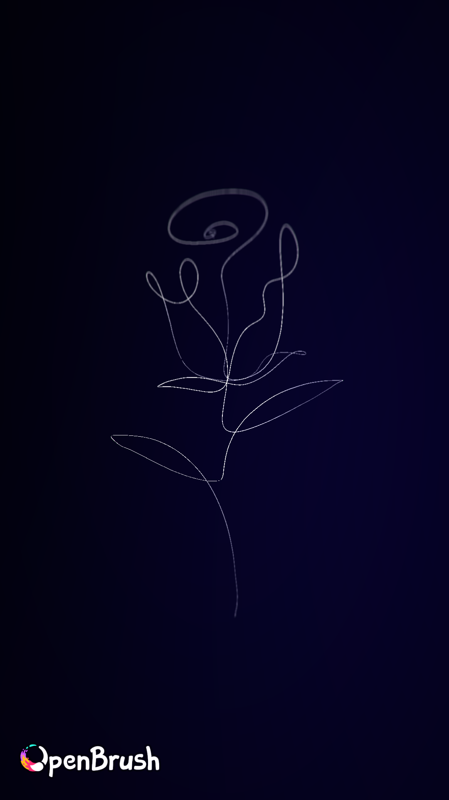
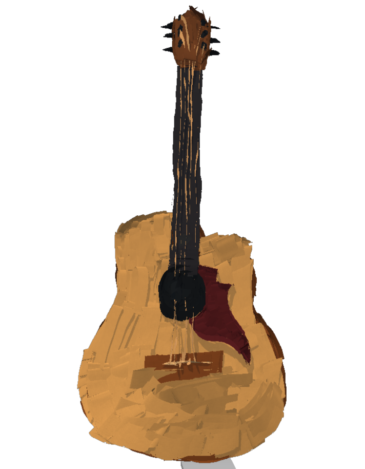

# OpenBrush VR Works

A small collection of 3D sketches and visual experiments created in **OpenBrush** 
using the **Meta Quest**, made for *CSCI 8605 — 3D Drawing in Extended Reality* 
at the University of Minnesota. These pieces explore form, composition, depth, 
and atmosphere through immersive, room-scale 3D drawing.

## Selected Pieces

   
  <em>Adam's Creation</em>

  
  

## Contents

- **Adam's Creation** — includes process sketches and step-by-step progression 
  images alongside the final piece.
- **Figure** — figure study with final result renders.
- **Rose** — a 3D rose sketch from multiple angles.
- **Shape** — abstract shape exploration.
- **guitar** — guitar study, including a comparison shot and passthrough view.

## Tools

- OpenBrush
- Meta Quest
- Image exports (`.jpg`, `.png`)
